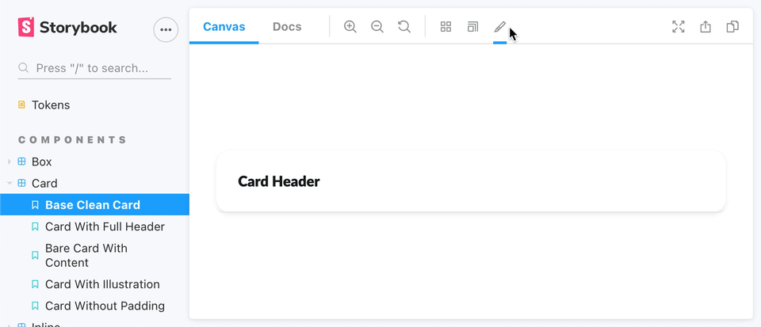

# Storybook Addon Multi Theme

Multiple themes simultaneously




## Installation

```sh
npm i -D storybook-addon-multi-theme
```

## Getting started

```js
// .storybook/main.js
module.exports = {
  addons: [
    // ...otherAddons
    'storybook-addon-multi-theme'
  ],
};
```

```js
// .storybook/preview.js
export const parameters = {
  multiTheme:
    {
      list: [
        {
          name: "Light",
          class: "light-theme",
          iconColor: "#fff",
          backgroundColor: `#fff`,
          selectedByDefault: true
        },
        {
          name: "Dark",
          class: "dark-theme",
          iconColor: "#1E2125",
          backgroundColor: `#1E2125`
        }
      ]
    }
}
```
